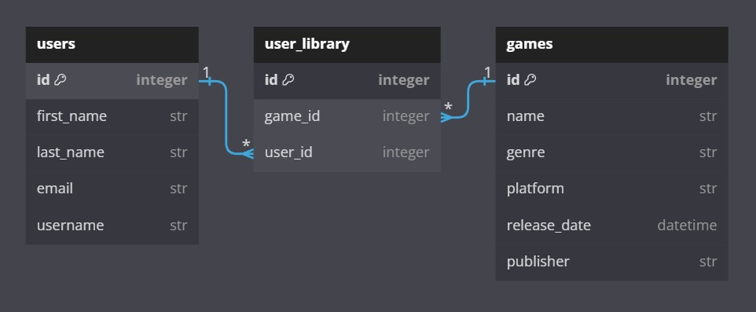

# Vapor Game Store CLI

## Description

Vapor Game Store CLI is a command line interface made with Python and SQLAlchemy. The application is modeled as video game store. Users can create a profile, login to view currently available games, view their game library, add or remove games from their game library, and view their profile information. The application also incorporates administrative actions, where an administrative user can add or remove games from the list of available games in the database, delete or update a users profile in the database, or view a list of all user profiles that have been created.

## Visuals

### Entity Relationship Diagram

## Installation

**NOTE:** Python v3.8 is required to use this application. Please see the official Python documentation for instructions on how to ensure Python v3.8 is installed and configured on your machine.

To install and use this application, please follow the steps below:

1. Fork this repository, and clone it to your own virtual environment
2. Once cloning is complete, navigate to the applications directory and run `pipenv install`
    - This should install ipdb, alembic, sqlalchemy, and tabulate v0.9.0
3. Once dependencies are installed open up the code in your preferred editor
4. Run `pipenv shell` to enter into the Python shell
5. The database should have a fresh seed already applied, but to run a new seed move down into the `lib/db` directory and run `python seed.py`
    - **CAUTION:** Running a new database seed will clear out any information added to the database since the last database seed
6. Once confirmation of the database seed is received, move back into the `lib` directory and run `python cli.py` to start the application

## Usage

**NOTE:** This section will be broken down by individual file, outlining the main purpose of each file and giving short descriptions of each individual function. If you decide to implement additional features and encounter any bugs, run the `debug.py` file while in the `lib` directory to enter into ipdb and begin debugging code.

### `cli.py`

This file executes the `Main()` script for the application upon running `cli.py` and starts the database session. It includes 3 main functions that utilize imported functions from `user_functions.py` and `admin_functions.py`. Other imports include database models from `models.py` and `sqlalchemy` imports for running and persisting database CRUD operations. All menu's in this file are rendered and executed through the use of python dictionaries, pairing option keys with tuples of a description and a lambda function.

1. `main_menu()`
    - This function is responsible for rendering the menu displayed on application launch. It handles user inputs to either login, create a profile, access the admin interface, or exit the application. **NOTE:** Password for the admin menu is "steam"

2. `handle_login(self, session)`
    - This function requests a username and validates that there is a user with that username. If not it prompts the user to create a profile. If the username is present in the users table, it displays the user interface menu. The user interface menu allows the user to view their game library, view available games, add or remove a game from their game library, and view their profile information.

3. `handle_admin_login(self, session)`
    - This function requests a password for entry, and then displays a menu of admin options. In the admin menu a user can add or remove games from the table of available games, delete or update a users profile, or view a table of all current user profiles.

### `user_functions.py`

This file contains all of the functions that operate the user interface menu. It also includes the function that allows the user to create a profile. I've placed several helper functions at the bottom of the file that house any repetitive code to help keep the application DRY. Imports for this file include `re`, `sys`, `tabulate`, and the `User_library` model. `re` is utilized for regex validation logic, `sys` is used to execute `sys.exit()` when a user chooses to exit the application, and `tabulate` is used for cleaner table visualization. All functions in this file operate inside of while loops to handle invalid entries or repeat a process (such as adding multiple games to their user library).

1. `create_user`
    - This function allows a user to create a profile record that is persisted to the `users` table in the database. It prompts the user to enter in various required user data, and uses regex validation logic to ensure table entries are within the specified parameters.

2. `view_user_library`
    - This function takes in a `User` model, cross examines the `user_library` join table, and then tabulates the users game library data into a table that is displayed to the user.

3. `view_available_games`
    - This function gives the user different options to search for games and queries the `games` table to access that data. User's can either view all games at once, or view games based on their platform. Data is tabulated into tables displayed to the user. 

4. `add_game_to_user_library`
    - This function gives the user different options to search for a game, queries the `games` table for that game, queries the `user_library` table to see if the game is already in the user's game library, and adds the game to the user's library if the game is not already present.

5. `remove_game_from_user_library`
    - This function works similar to the previous function, but reverses some of the logic to remove a game from the users game library.

6. `view_user_profile`
    - This function takes in a `User` model, tabulates the user's profile data into a table, and displays that data to the user.

### `admin_functions.py`

This file contains all of the functions that operate the admin menu. I've placed several helper functions at the bottom of the file that house any repetitive code to help keep the application DRY. Imports for this file include `re`, `tabulate`, `datetime`, and the `handle_exit()` from the `user_functions.py` file. `datetime` is imported to handle release date entries when adding new games, and `handle_exit()` is imported to facilitate exiting the app and keeping the code DRY. Several functions operate in while loops to facilitate the use of the Python `continue` statement.

1. `add_to_available_games`
    - This functions allows the admin to add games to the `games` table. Similar to a user creating a profile, this function prompts the admin to enter in various required game data, uses regex validation to ensure data is within specific parameters, and then persists the created record to the `games` table.

2. `remove_from_available_games`
    - This function works similar to the previous function, but utilizes different logic to remove a game from the `games` table. It also cross checks the `user_library` table and handles removing the game from all user libraries via the `game_removal` helper function.

3. `delete_user_profile_data`
    - This function allows the admin to search for a user profile by username or email, and then removes that user from the `users` table via the `user_removal` helper function.

4. `update_user_profile_data`
    - This function allows the admin to seach for a user profile by username or email, and then updates the username or email via the `update_username_sub_menu` helper function or the `email_update_sub_menu` helper function.

5. `view_all_users`
    - This function queries the `users` table for all users and then tabulates the data into a table displayed to the admin.

6. `game_removal` and `user_removal`
    - These helper functions utilize complex logic to remove games and users from each respective table. The `user_removal` function facilitates the removal of not only the user, but also all associated entries in the `user_library` table. The `game_removal` function operates in the same manner. Due to the nature of needing to remove record entries from the `user_library` table via foreign keys, the function utilizes raw SQL expressions to accomplish the task. It then adjusts remaining primary keys in the `games` table down by one.

### `models.py`

This file contains all table models utilized in the CLI database. It includes various imports from `sqlalchemy` to create models, form join tables, and define base models and entries.

1. `User`
    - This model creates the `users` table and defines base entries. It also sets up the user relationship to the `user_library` join table.

2. `Game`
    - This model creates the `games` table and defines base entries. It also sets up the game relationship to the `user_library` join table.

3. `User_library`
    - This model creates the `user_library` table, and sets up foreign key relationships to `Game` and `User` records.

### `seed.py`

This file contains seed data for the database. It seeds 20 different `Game` models to the database and two `User` models to the database that can be utilized for database testing and application usage testing. It also establishes a few relationships between the `User` and `Game` models in the `user_library` join table for testing functions operating on the join table.

## Contributing

Pull requests are welcome! Please feel free to reach out to me if there are specific features you'd like to see implemented!  
For major changes, please utilize the support email above to discuss what you would like to change.  
All pushes to main branch will be made upon my approval.  
Please make sure to run and update tests as appropriate.

## License

MIT License

Copyright (c) 2023 Brian Ashman

Permission is hereby granted, free of charge, to any person obtaining a copy
of this software and associated documentation files (the "Software"), to deal
in the Software without restriction, including without limitation the rights
to use, copy, modify, merge, publish, distribute, sublicense, and/or sell
copies of the Software, and to permit persons to whom the Software is
furnished to do so, subject to the following conditions:

The above copyright notice and this permission notice shall be included in all
copies or substantial portions of the Software.

THE SOFTWARE IS PROVIDED "AS IS", WITHOUT WARRANTY OF ANY KIND, EXPRESS OR
IMPLIED, INCLUDING BUT NOT LIMITED TO THE WARRANTIES OF MERCHANTABILITY,
FITNESS FOR A PARTICULAR PURPOSE AND NONINFRINGEMENT. IN NO EVENT SHALL THE
AUTHORS OR COPYRIGHT HOLDERS BE LIABLE FOR ANY CLAIM, DAMAGES OR OTHER
LIABILITY, WHETHER IN AN ACTION OF CONTRACT, TORT OR OTHERWISE, ARISING FROM,
OUT OF OR IN CONNECTION WITH THE SOFTWARE OR THE USE OR OTHER DEALINGS IN THE
SOFTWARE.

### What Goes into a README?

This README should serve as a template for your own- go through the important
files in your project and describe what they do. Each file that you edit
(you can ignore your Alembic files) should get at least a paragraph. Each
function should get a small blurb.

You should descibe your actual CLI script first, and with a good level of
detail. The rest should be ordered by importance to the user. (Probably
functions next, then models.)

Screenshots and links to resources that you used throughout are also useful to
users and collaborators, but a little more syntactically complicated. Only add
these in if you're feeling comfortable with Markdown.

***

## Conclusion

A lot of work goes into a good CLI, but it all relies on concepts that you've
practiced quite a bit by now. Hopefully this template and guide will get you
off to a good start with your Phase 3 Project.

Happy coding!

***

## Resources

- [Setting up a respository - Atlassian](https://www.atlassian.com/git/tutorials/setting-up-a-repository)
- [Create a repo- GitHub Docs](https://docs.github.com/en/get-started/quickstart/create-a-repo)
- [Markdown Cheat Sheet](https://www.markdownguide.org/cheat-sheet/)
